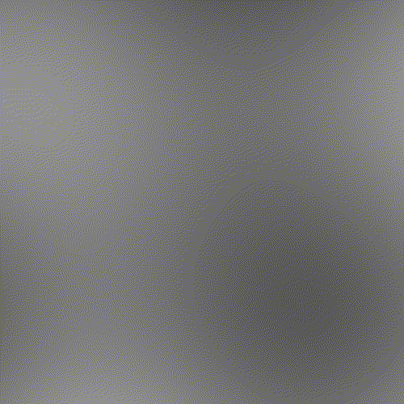

# Perlin Noise

an Implementation of the improved perlin noise algorithm found here: https://mrl.nyu.edu/~perlin/noise/

A visualization can be seen here, the image is moving through perlin noise in all 3 dimensions:

